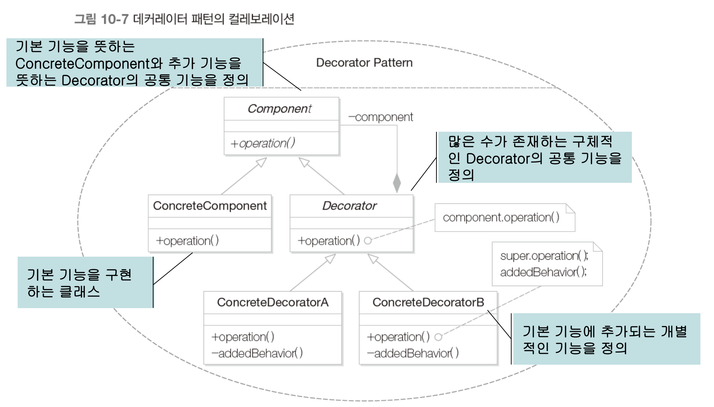
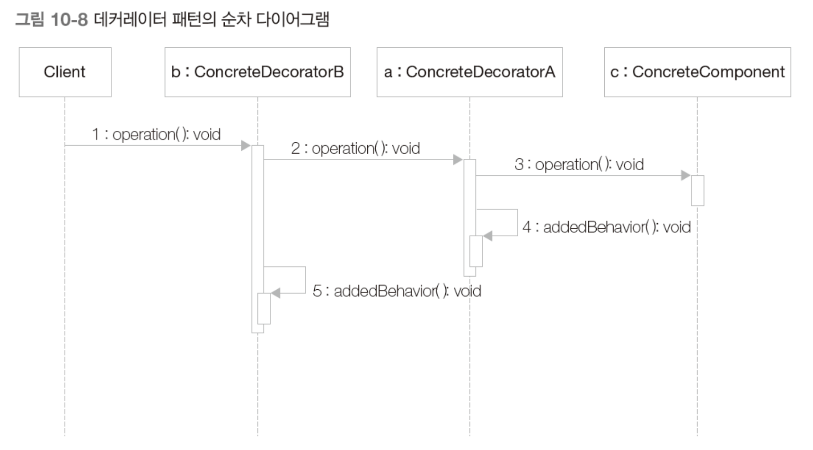

# 데코레이터 패턴

**데코레이터 패턴**은 기본 기능에 추가될 수 있는 **많은 수의 부가 기능**에 대해서 다양한 조합을 **동적**으로 구현할 수 있는 패턴이다.

기본 기능에 추가할 수 있는 기능의 종류가 많은 경우 사용한다.

## 사용 이유

추가 기능을 조합해야 하는 경우, 경우의 수가 기하급수적으로 늘어나며 작성해야 하는 클래스가 너무 많아진다.

## 특징

> 데코레이터 패턴은 **감싸주는것**이다.

- 여러 데코레이터를 사용할 수 있다.
- 순서가 상관없다.

---

